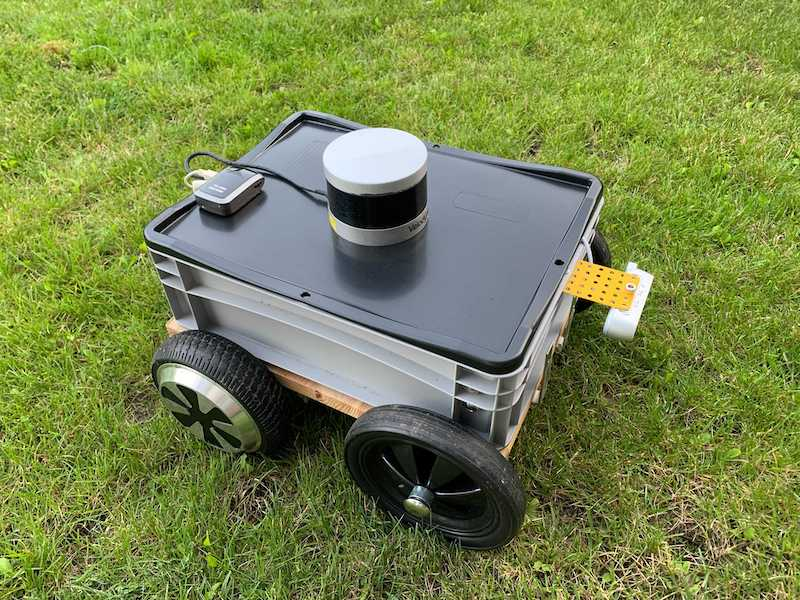
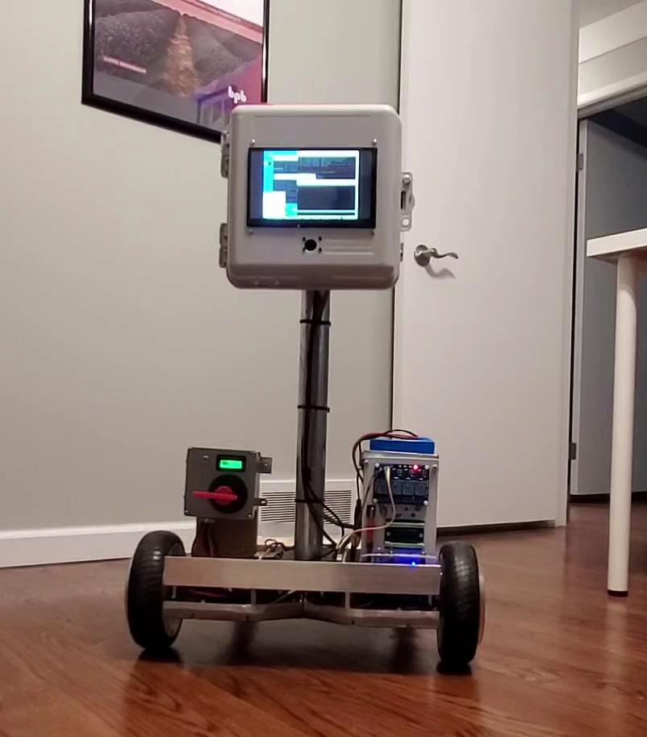
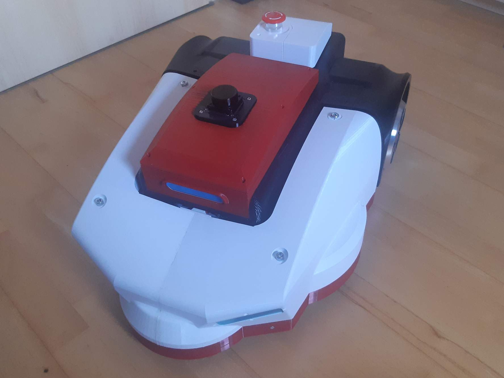

## Welcome to Hoverboard Robotics

This website is dedicated to the robotic projects built on the customized hoverboard platform. Robotics enthusiasts across the world are using hoverboard controller and motors as an inexpensive and powerful mobile base for all sorts of projects: delivery robots, service robots, computer vision test benches etc.

This website is maintained by a team of roboticists, originally connected in the [Slack community](https://join.slack.com/t/robaka/shared_invite/zt-q52yfvnl-IP0h~JDOmgh3VmJ7Hh69Jw) dedicated to the Hoverboard support in ROS.

## Why Hoverboard?

* Low cost: new units can be found around $100, used boards are dirt-cheap on flea markets
* Low bootstrapping effort: complete robot chassis can be built and "ready to run" in 1 day with off-the-shelf parts
* 2x350 W brushless motors
* 36V, 4Ah battery
* Well-studied reverse engineered firmware
  *  [Original firmware by Niklas Fauth](https://github.com/NiklasFauth/hoverboard-firmware-hack)
  *  [Bipropellant firmware](https://github.com/bipropellant/bipropellant-hoverboard-firmware)
  *  [Emanuel Feru firmware](https://github.com/EmanuelFeru/hoverboard-firmware-hack-FOC)
* [ROS1 driver](https://github.com/alex-makarov/hoverboard-driver) 

## [Gallery](gallery.md)

## Projects

| Project                                              | Author                                          | Images                                  | Description                            |
|------------------------------------------------------|-------------------------------------------------|-----------------------------------------|----------------------------------------|
| [Robaka](https://github.com/alex-makarov/robaka-ros) | [Alex Makarov](https://github.com/alex-makarov) |  | Prototype of a sidewalk delivery robot |
| José | [Lloyd Brombach](https://github.com/lbrombach) |  | Multi-purpose robotics platform |
| [HoverMower](https://hovermower.github.io/) | [Patrick Weber](https://github.com/hovermower) |  | Robot lawn mower |
| [OpenDR](https://www.opendr.xyz/) | [OpenDR team](opendrxyz@gmail.com) |  | Open Delivery Robot | 
| [HTB](https://htb-hovertablebot.github.io/) | [Martin Nievas](https://github.com/MartinNievas) | | Research robotics platform |

## To Do
* Publish at least one open source robot design, along with BoM and build instructions
